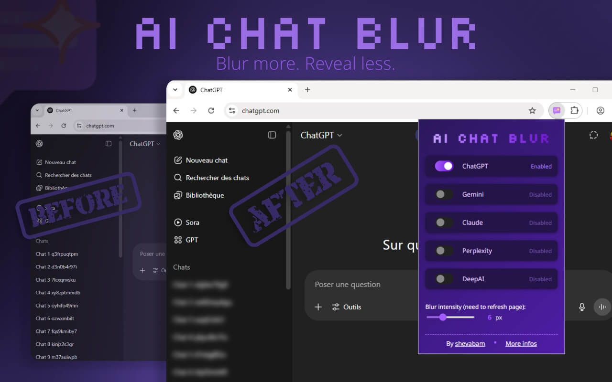
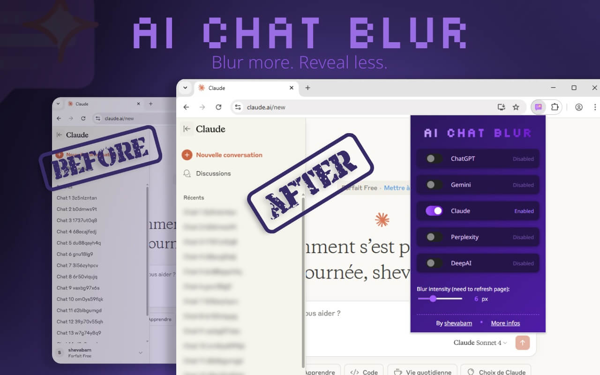
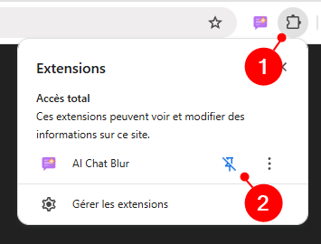
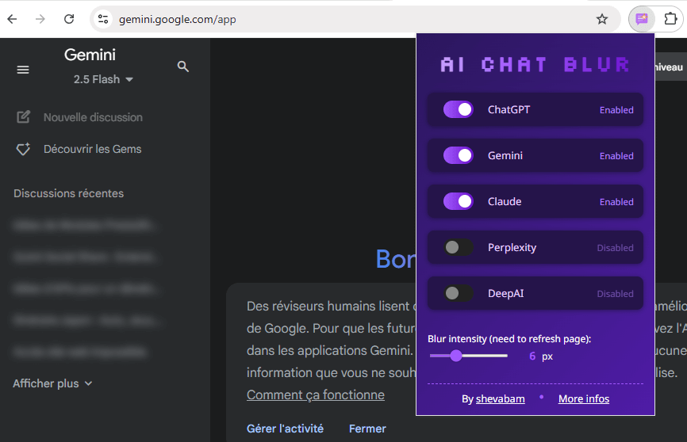

# AI Chat Blur

**AI Chat Blur** is a Chrome extension to blur the chat titles of popular AI chat platforms for privacy, focus, and a visually appealing experience.

## Features

- **Blur Chat Titles**: instantly blur the chat history on ChatGPT, Gemini, Claude, Perplexity, and DeepAI
- **Per-Service Enable/Disable**: toggle the blur effect for each supported service individually
- **Customizable Blur Strength**: adjust the blur intensity (2–15px) with a sleek slider in the popup
- **Persistent Preferences**: All settings are saved and synchronized across Chrome browsers using your Google account

## Who Is This For?

- Anyone who uses AI chat services and wants to keep their sidebar/chat history private (e.g., in public, at work, during screen sharing)
- Power users who want a cleaner, less distracting interface
- Anyone who wants to customize the look of their favorite AI chat platforms

## Installation

Download the extension from the [**Chrome Web Store**](https://chromewebstore.google.com/detail/ai-chat-blur/cemfhmnfgpcknjmbjabcobjhcfmipdki) or [**Microsoft Edge Store**]()

After installing the extension, pin it to your browser:

## Settings

- Service Toggles: enable or disable blur for each supported platform **(ChatGPT, Gemini, Claude, Perplexity, DeepAI)**
- Blur Intensity: choose the blur level (2–15px) using the slider. Changing this may require a page refresh to fully apply
- All settings are saved automatically and synced across Chrome if you are logged in

## Privacy

- No external requests: the extension does not send your data anywhere
- No analytics, tracking, or ads
- All preferences are stored locally or in Chrome Sync
- Only requests the minimal permissions needed to operate on supported AI chat sites

## Contributing

Contributions, bug reports, and suggestions are welcome!

1. [Open an issue](https://github.com/shevabam/extension-ai-chat-blur/issues) for bugs or feature requests.
2. Fork the repository and submit a pull request.
3. Please follow the existing code style and add clear commit messages.

If you find this extension useful, you can also support its development by [buying me a pizza](https://buymeacoffee.com/shevabam).

## Author

Created by [@shevabam](https://github.com/shevabam)

- [X](https://x.com/shevabam)
- [Bluesky](https://bsky.app/profile/shevabam.bsky.social)
- [Mastodon](https://mastodon.social/web/@shevabam)
- [Blog](https://blog.shevarezo.fr)

